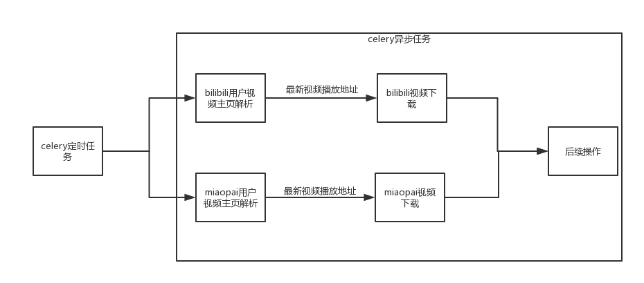
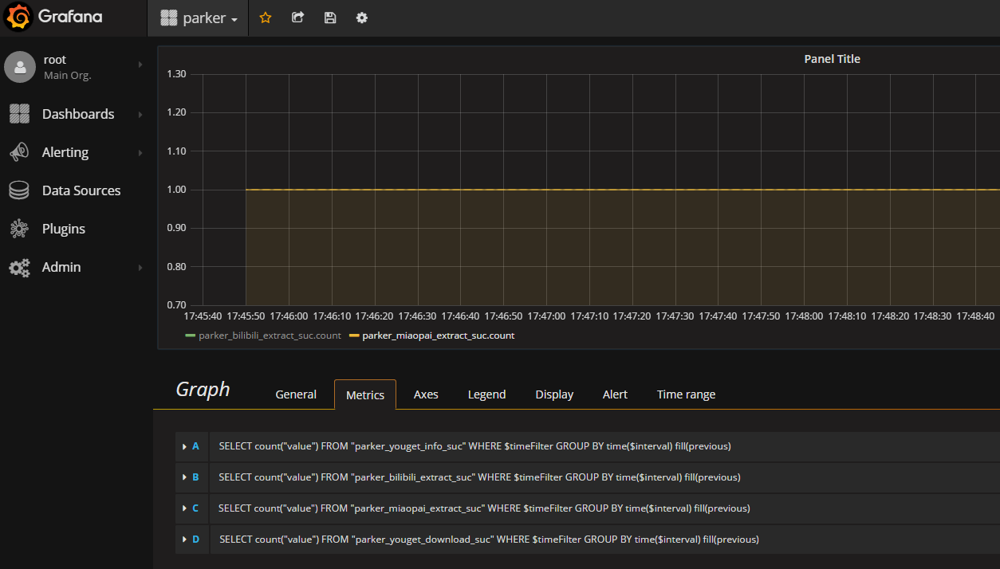

# parker

parker短视频爬虫项目（项目地址：[https://github.com/LiuRoy/parker](https://github.com/LiuRoy/parker)），它采用celery框架定时爬取用户视频列表，将最新发布的视频通过you-get异步下载，可以很方便地实现分布式部署。因为各个网站的页面布局和接口更新比较频繁，为了保证程序的高可用，特意增加了Statsd监控，方便及时发现出错。

## 代码架构



目前parker中只实现了B站和秒拍的下载，从框架图可以看出，针对每一类网站，需要实现两个异步接口：从用户视频主页解析发布视频的播放地址、根据播放地址下载视频。因此增加网站类型，不需要修改原来的代码，只需要添加新的解析和下载接口即可。针对视频下载完成之后的后续操作，我还没有实现，大家可以根据自己的需求自由的去实现。

在运行的时候，celery会将配置好的优质用户列表定时发送到对应网站的解析接口异步执行，筛选出最新发布的视频播放地址，交给对应的下载接口异步下载，下载完成之后再异步调用后续操作。因此需要启动一个celery beat进程发送定时任务，以及若干celery异步任务去执行解析和下载操作，对于比较大的视频，下载会相当耗时，建议根据任务列表的多少合理分配异步任务的个数。

## 程序运行

经验证，此程序可以在ubuntu和mac下正常运行， 由于本地windows下的celery无法正常启动，所以没有在windows环境做过验证。

### 依赖库安装

python版本为3.5，进入项目目录后，执行：

```bash
pip install -r requirements.txt
```

### 创建数据库表

提前在数据库中建好两张表（sql: [https://github.com/LiuRoy/parker/blob/master/spider/models/tables.sql](https://github.com/LiuRoy/parker/blob/master/spider/models/tables.sql)）

### 参数配置

config路径下的logging.yaml、params.yaml、sites.yaml分别对应日志配置、运行参数配置、热门用户配置。

#### 日志配置

debug模式下日志会直接输出在标准输出流，release模式下会将日志内容输出到文件中，因此需要配置输出日志文件。

#### 运行配置

+ mode debug调试模式，此模式下日志指向标准输出，并且没有监控数据；release模式下，日志输出到制定文件，并且有监控数据。
+ broker_url 对应于celery的BROKER_URL，可以配置为redis或者rabbitmq
+ mysql_url 数据库地址，需要提前建好两张表
+ download_path 视频下载路径
+ statsd_address 监控地址
+ video_number_per_page 每次从用户视频主页解析出多少条视频播放地址，因为大部分用户每次发布的视频个数很少，只需要设置成一个很小的值即可。在初次运行的时候，也不会下载大量久远的视频。
+ download_timeout 视频下载的超时时间

#### 热门用户配置

parker会根据此配置生成一份celery beat scheduler列表。

+ name 规则是`<网站类型>-<任务id>`，parker会根据此作为scheduler任务名称
+ url 用户的发布视频主页
+ task 对应的celery解析异步任务
+ minute 多少分钟检查一次用户视频列表

### 启动任务

进入项目目录，执行下面命令启动celery worker

```bash
celery -A spider worker
```

执行下面命令启动celery beat定时任务

```bash
celery -A spider beat
```

## 监控

强烈安利一个docker镜像 [https://hub.docker.com/r/samuelebistoletti/docker-statsd-influxdb-grafana/](https://hub.docker.com/r/samuelebistoletti/docker-statsd-influxdb-grafana/)，一分钟配好监控环境有木有。之后只需要添加执行成功和执行异常的打点数据，就可以方便的监控程序是否正常运行了。

